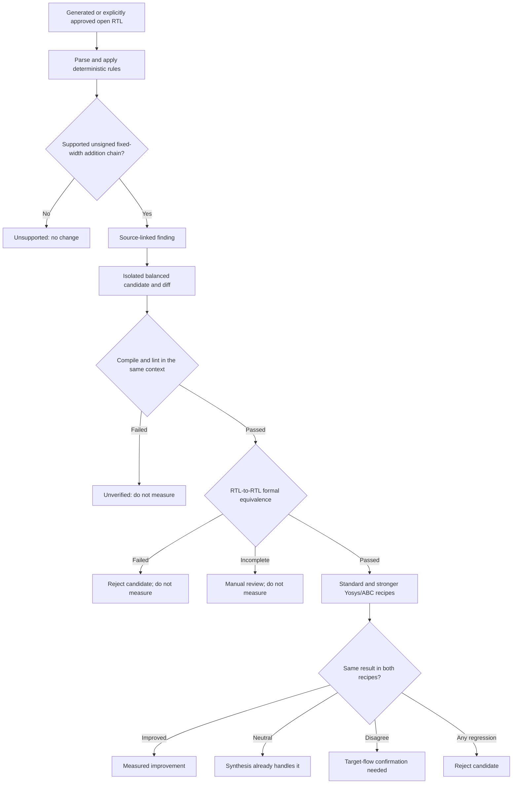

# RTL Advisor

**RTL Advisor tells an engineer whether a narrowly supported RTL rewrite is
behavior-preserving and whether two pinned Yosys/ABC recipes actually benefit—or
synthesis already handles it—before target-flow iteration.**

I am building this as an evidence tool, not an RTL generator that asks engineers
to trust a suggestion. It links a finding to source, prepares a change in an
isolated copy, requires formal equivalence, and measures the original and
candidate under identical synthesis settings.

> **Status:** `0.2.0a1` developer preview. The generated end-to-end example
> formally passes and returns `synthesis_handles`: both pinned Yosys/ABC recipes
> found no useful improvement. The frozen open-RTL pilot gate is blocked at
> **0/2 qualifying modules**, before candidate synthesis or PPA inspection.

## What problem this addresses

Synthesis already removes many source-level differences. That makes “rewrite
this RTL” incomplete advice: the change may be unsafe, irrelevant after
synthesis, dependent on one recipe, or harmful.

RTL Advisor turns one conservative source finding into one of four measured
outcomes:

- `measured_improvement` — both recorded recipes meet the improvement rule.
- `synthesis_handles` — both recipes are neutral; keep the original RTL.
- `flow_dependent` — the recipes disagree; confirm in the target flow.
- `regression` — at least one recipe regresses; reject the candidate.

For a run with multiple eligible sites, the report also shows whether every
site reached a terminal result. Missing candidates, proofs, or measurements are
reported as **evidence incomplete** rather than allowing a partial positive
result to stand in for the whole run.

These are Yosys/ABC results against the recorded Liberty file. They are not
Genus, Design Compiler, physical-timing, power, or production-PPA predictions.

## MVP workflow



The original source stays byte-identical. Candidate, proof, and measurement
records are append-only, hash-linked artifacts; reports are derived from those
records. A changed source or compile context invalidates later evidence.

## Supported in this preview

The decision path supports one transformation only: balancing an unbalanced
continuous assignment with at least three unsigned, equal-width, fixed-width
addends in a self-contained combinational module. It rejects sequential state,
mixed signedness, implicit truncation, macros, functions, generated spans,
ambiguous drivers, and unresolved compile context.

The V2.2 ML model remains **diagnostic-only**. It does not select findings,
unlock candidates, or decide the final result. The MVP uses deterministic rules,
formal evidence, and measured synthesis evidence.

## Run the generated example

Prerequisites are Python 3.13, `uv`, Verilator, the Yosys 0.63 release line with
its adjacent `yosys-abc` 1.01 executable, and the pinned Nangate45 Liberty file
configured in `rtl-advisor.toml`. The complete tool versions and executable
hashes are recorded and must remain unchanged during a proof or measurement.

```bash
uv sync --frozen --extra sv --group dev
uv run --frozen rtl-advisor setup --json
uv run --frozen rtl-advisor agent capabilities --schema-version 2 --json

uv run --frozen rtl-advisor agent review examples/mvp/adder_chain.sv \
  --top adder_chain \
  --objective balanced \
  --schema-version 2 \
  --json
```

`setup` downloads and checksum-verifies the configured open Liberty file when it
is missing. Its environment report also checks Codex, which is needed only for
the plugin interface; the terminal pipeline itself remains CLI-driven.

Copy `run_id` and the first `finding_id` from the review result, then run the
remaining Agent V2 operations exactly as follows:

```bash
uv run --frozen rtl-advisor agent candidate <run-id> \
  --finding <finding-id> \
  --schema-version 2 \
  --json

uv run --frozen rtl-advisor agent verify <run-id> \
  --candidate <candidate-id> \
  --schema-version 2 \
  --json

uv run --frozen rtl-advisor agent measure <run-id> \
  --candidate <candidate-id> \
  --schema-version 2 \
  --json

uv run --frozen rtl-advisor agent report <run-id> \
  --schema-version 2 \
  --json
```

`measure` refuses to run without a current `formal_passed` record. The generated
fixture currently reaches `synthesis_handles`, which is useful evidence that the
tested synthesis recipes already normalize this rewrite.

Agent V1 remains the default for existing operations through the `0.2.x` line.
New integrations should pass `--schema-version 2` explicitly. Agent V2 is
`rtl-advisor-agent-v2`; stored run records use `rtl-advisor-run-v1`.

## Read-only dashboard

The dashboard displays stored run evidence; it never uploads RTL or starts EDA
tools.

```bash
uv run --frozen rtl-advisor frontend --host 127.0.0.1 --port 8765
```

Open `http://127.0.0.1:8765`. The run viewer presents Review → Candidate →
Formal → Synthesis → Final result, including the source location, diff, proof
limits, both synthesis recipes, hashes, logs, and reproduction commands. Its
read-only endpoints are:

```text
GET /api/runs/v1
GET /api/runs/v1/{run_id}
GET /api/runs/v1/{run_id}/diff
GET /api/runs/v1/{run_id}/artifacts
```

The earlier V2.2 research evidence remains available as a secondary dashboard
view.

## Codex interface

The Codex plugin invokes the same Agent V2 CLI stages and explains their JSON in
plain language. Codex can summarize a finding, diff, proof, or measurement, but
it cannot override formal failure or change a synthesis classification. No MCP
server is required for the local MVP.

An engineer can ask:

> Use RTL Advisor to review `adder_chain.sv` for balanced timing and area,
> prepare the supported candidate, prove it, measure it, and explain whether the
> synthesis recipes already handle the change.

## Current evidence and open-pilot gate

The complete generated workflow has produced a hash-matched formal pass and a
`synthesis_handles` result under the standard and stronger pinned recipes.

The pre-registered open corpus was screened in a fixed order. None of its four
projects contained a module that met every frozen MVP rule, so the requirement
to freeze pilots from two independent projects ended at **0/2**. Candidate
synthesis and PPA were not run, and the benchmark family was not changed after
seeing an outcome. This avoids selecting only favorable examples.

That gate remains blocked until a new corpus is pre-registered or a separately
reviewed scope adds combinational-cone extraction. The generated result proves
the pipeline works; it does not establish value on arbitrary engineer RTL.

## Why engineers can trust the result

- A deterministic rule—not ML or Codex—selects the supported source pattern.
- The tool edits an isolated copy and records source, context, and diff hashes.
- Direct Yosys RTL-to-RTL equivalence gates all synthesis measurement.
- Deliberately incorrect controls must fail the same formal checker.
- Baseline and candidate use identical library, constraints, recipe, and tool
  versions.
- Neutral results and regressions are published instead of hidden.
- Every conclusion states the flow it measures and the limits of that evidence.

Formal equivalence proves equality between the modeled baseline and candidate;
it does not prove that the baseline implements its specification.

## What is needed next

The immediate release gate needs two frozen open-source pilots that meet the
same rules. Broader recommendations later need more independent RTL structures,
multiple equivalent variants per supported family, formal results for every
training candidate, identical-flow synthesis labels, and repository-separated
training and test sets.

ML can enter a future decision path only after enough independent evidence is
collected and a frozen release test passes. Sequential modules, EQY, commercial
LEC, target-flow synthesis, OpenROAD gating, proprietary RTL, and SoC-scale
operation remain later tracks.

## Documentation

- [MVP V1 implementation plan](implementation%20plan/MVP%20V1.md)
- [Frozen open-RTL feasibility result](docs/evidence/mvp-v1-feasibility.md)
- [Known limitations](docs/known-limitations.md)
- [Pilot manifest example](examples/mvp/pilot-manifest.example.md)
- [Changelog](CHANGELOG.md)
- [Progress updates](progress%20updates/)

No project license has been added yet; owner confirmation is required before
release or tagging.
