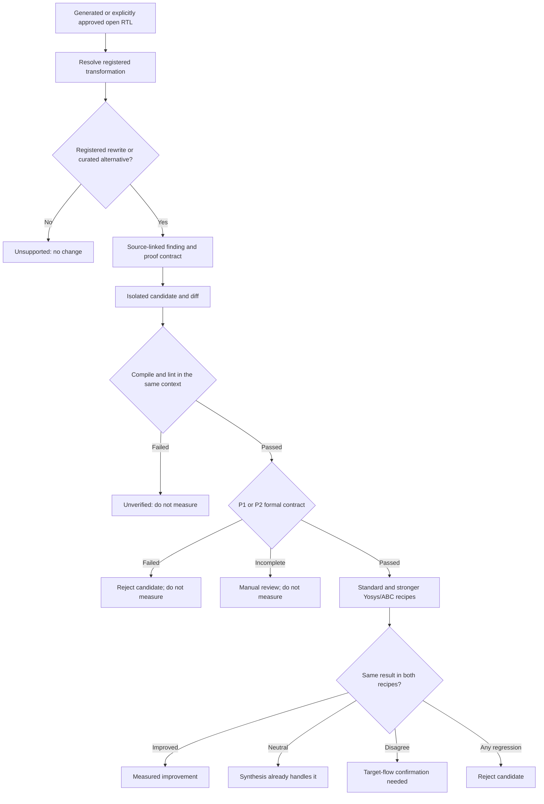

# RTL Advisor

**RTL Advisor is an evidence-backed RTL engineering platform that compares
behavior-preserving implementation alternatives across modules, IPs,
subsystems, and SoCs, then reports whether a measured flow benefits or already
handles the change.**

I am building this as an evidence tool, not an RTL generator that asks engineers
to trust a suggestion. It links a finding to source, prepares a change in an
isolated copy, requires formal equivalence, and measures the original and
candidate under identical synthesis settings.

> **Status:** `0.2.0a1` developer preview. The generated example returns
> `synthesis_handles`. The first realistic same-cycle arbiter slice now has one
> P2-safe result that repeats in Yosys/ABC and OpenROAD at its frozen N=8
> configuration. The broader family gate is still open: this is evidence for
> one reference/alternative pair, not a general optimization claim.

The current preview supports one narrow combinational rewrite and one curated
same-cycle sequential alternative. The long-range program is intentionally
larger: a curated Tier A–D corpus of 50–100
standalone modules, 15–30 complete IP blocks, 5–10 processor or accelerator
subsystems, and 2–4 complete SoCs. Variants do not count toward those totals;
every reference must have pinned provenance, compile context, behavioral basis,
proof scope, and reproducible measurements.

## What problem this addresses

Synthesis already removes many source-level differences. That makes “rewrite
this RTL” incomplete advice: the change may be unsafe, irrelevant after
synthesis, dependent on one recipe, or harmful.

RTL Advisor turns one conservative source finding into one of four measured
outcomes:

- `measured_improvement` — both recorded recipes meet the improvement rule.
- `synthesis_handles` — both recipes are neutral; keep the original RTL.
- `flow_dependent` — the recipes disagree; confirm in the target flow.
- `regression` — at least one recipe regresses; reject the candidate.

For a run with multiple eligible sites, the report also shows whether every
site reached a terminal result. Missing candidates, proofs, or measurements are
reported as **evidence incomplete** rather than allowing a partial positive
result to stand in for the whole run.

These are Yosys/ABC results against the recorded Liberty file. They are not
Genus, Design Compiler, physical-timing, power, or production-PPA predictions.

## MVP workflow


```mermaid
flowchart TD
    A["Generated or explicitly approved open RTL"] --> B["Resolve registered transformation"]
    B --> C{"Registered rewrite or curated alternative?"}
    C -- "No" --> C1["Unsupported: no change"]
    C -- "Yes" --> D["Source-linked finding and proof contract"]
    D --> E["Isolated candidate and diff"]
    E --> E1{"Compile and lint in the same context"}
    E1 -- "Failed" --> E2["Unverified: do not measure"]
    E1 -- "Passed" --> F{"P1 or P2 formal contract"}
    F -- "Failed" --> F1["Reject candidate; do not measure"]
    F -- "Incomplete" --> F2["Manual review; do not measure"]
    F -- "Passed" --> G["Standard and stronger Yosys/ABC recipes"]
    G --> H{"Same result in both recipes?"}
    H -- "Improved" --> H1["Measured improvement"]
    H -- "Neutral" --> H2["Synthesis already handles it"]
    H -- "Disagree" --> H3["Target-flow confirmation needed"]
    H -- "Any regression" --> H4["Reject candidate"]
```

The original source stays byte-identical. Candidate, proof, and measurement
records are append-only, hash-linked artifacts; reports are derived from those
records. A changed source or compile context invalidates later evidence.

## Supported in this preview

The transformation registry currently supports:

- `adder_reduction_association`: a deterministic isolated rewrite for an
  unsigned, equal-width, fixed-width combinational addition chain, gated by P1
  RTL equivalence.
- `same_cycle_arbiter_topology`: the curated OpenTitan
  `prim_arbiter_ppc`/`prim_arbiter_tree` alternative, gated by a P2 same-cycle
  sequential contract.

The adder rule rejects sequential state, mixed signedness, implicit truncation,
macros, functions, generated spans, ambiguous drivers, and unresolved compile
context. The arbiter alternative is available only through its pinned,
qualified corpus reference; it is not an unseen-RTL rewrite.

The V2.2 ML model remains **diagnostic-only**. It does not select findings,
unlock candidates, or decide the final result. The MVP uses deterministic rules,
formal evidence, and measured synthesis evidence.

## Run the generated example

Prerequisites are Python 3.13, `uv`, Verilator, the Yosys 0.63 release line with
its adjacent `yosys-abc` 1.01 executable, and the pinned Nangate45 Liberty file
configured in `rtl-advisor.toml`. The complete tool versions and executable
hashes are recorded and must remain unchanged during a proof or measurement.

```bash
uv sync --frozen --extra sv --group dev
uv run --frozen rtl-advisor setup --json
uv run --frozen rtl-advisor agent capabilities --schema-version 2 --json

uv run --frozen rtl-advisor agent review examples/mvp/adder_chain.sv \
  --top adder_chain \
  --objective balanced \
  --schema-version 2 \
  --json
```

`setup` downloads and checksum-verifies the configured open Liberty file when it
is missing. Its environment report also checks Codex, which is needed only for
the plugin interface; the terminal pipeline itself remains CLI-driven.

Copy `run_id` and the first `finding_id` from the review result, then run the
remaining Agent V2 operations exactly as follows:

```bash
uv run --frozen rtl-advisor agent candidate <run-id> \
  --finding <finding-id> \
  --schema-version 2 \
  --json

uv run --frozen rtl-advisor agent verify <run-id> \
  --candidate <candidate-id> \
  --schema-version 2 \
  --json

uv run --frozen rtl-advisor agent measure <run-id> \
  --candidate <candidate-id> \
  --schema-version 2 \
  --json

uv run --frozen rtl-advisor agent report <run-id> \
  --schema-version 2 \
  --json
```

`measure` refuses to run without a current `formal_passed` record. The generated
fixture currently reaches `synthesis_handles`, which is useful evidence that the
tested synthesis recipes already normalize this rewrite.

The frozen OpenTitan reference uses the same Agent V2 commands:

```bash
uv run --frozen rtl-advisor agent review \
  corpus/registry-v1/references/opentitan-prim-arbiter-ppc/000007-after-fe8ac76915242cad.json \
  --objective timing \
  --schema-version 2 \
  --json
```

That review exposes the pre-registered N=1, 4, 8, and 16 configurations as
separate findings. Each alternative remains unproven until its registered P2
backend passes.

Agent V1 remains the default for existing operations through the `0.2.x` line.
New integrations should pass `--schema-version 2` explicitly. Agent V2 is
`rtl-advisor-agent-v2`; stored run records use `rtl-advisor-run-v1`.

## Read-only dashboard

The dashboard displays stored run evidence; it never uploads RTL or starts EDA
tools.

```bash
uv run --frozen rtl-advisor frontend --host 127.0.0.1 --port 8765
```

Open `http://127.0.0.1:8765`. The run viewer presents Review → Candidate →
Formal → Synthesis → Final result, including the source location, diff, proof
limits, both synthesis recipes, hashes, logs, and reproduction commands. Its
Explore adds filterable M0/M1 area-versus-delay plots, candidate-outcome
composition, reproducibility facts, exact measurement rows, and CSV export.
When a current family-study aggregate is present, Explore uses that compact,
hash-validated record linked to the matching formal-safety aggregate; otherwise
it falls back to verified Agent V2 run measurements. Its read-only endpoints
are:

```text
GET /api/runs/v1
GET /api/runs/v1/{run_id}
GET /api/runs/v1/{run_id}/diff
GET /api/runs/v1/{run_id}/artifacts
GET /api/analytics/v1
```

The earlier V2.2 research evidence remains available as a secondary dashboard
view.

## Codex interface

The Codex plugin invokes the same Agent V2 CLI stages and explains their JSON in
plain language. Codex can summarize a finding, diff, proof, or measurement, but
it cannot override formal failure or change a synthesis classification. No MCP
server is required for the local MVP.

An engineer can ask:

> Use RTL Advisor to review `adder_chain.sv` for balanced timing and area,
> prepare the supported candidate, prove it, measure it, and explain whether the
> synthesis recipes already handle the change.

## Current evidence

### Realistic same-cycle arbiter slice

The frozen OpenTitan `prim_arbiter_ppc` reference and upstream
`prim_arbiter_tree` alternative were evaluated at N=1, 4, 8, and 16 with
`DW=32` and `EnDataPort=1`.

All four configurations passed the strengthened P2 contract in both clean
repeats. Incorrect reset, mask-state, grant, and data-selection controls each
produced a counterexample. M0/M1 normalized metrics and netlist hashes
reproduced exactly; M2 area and delay also reproduced with 0% drift.

| Configuration | Pinned Yosys/ABC | Pinned OpenROAD | Supported conclusion |
| --- | --- | --- | --- |
| N=1 | Neutral | Not sampled | Synthesis handles the difference |
| N=4 | 14.35% faster, 10.57% more area | Not sampled | Reject: area guardrail exceeded |
| N=8 | 21.20% faster, 2.38% less area | 29.35% faster, 1.69% less area | OpenROAD-confirmed improvement in the pinned flows |
| N=16 | 27.43% faster, 0.52% less area | 0.90% slower, 6.60% less area | Cross-flow disagreement; do not recommend |

The N=8 result permits only these narrow statements: “repeatable Yosys/ABC
improvement for this configuration” and “confirmed by the pinned OpenROAD
cross-check.” It is not Genus, target-flow, production-PPA, or unseen-RTL
evidence. The family remains below its ten-pair and three-lineage release gate.

### Earlier generated and corpus evidence

The complete generated workflow has produced a hash-matched formal pass and a
`synthesis_handles` result under the standard and stronger pinned recipes.

The pre-registered open corpus was screened in a fixed order. None of its four
projects contained a module that met every frozen MVP rule, so the requirement
to freeze pilots from two independent projects ended at **0/2**. Candidate
synthesis and PPA were not run, and the benchmark family was not changed after
seeing an outcome. This avoids selecting only favorable examples.

That gate remains blocked until a new corpus is pre-registered or a separately
reviewed scope adds combinational-cone extraction. The generated result proves
the pipeline works; it does not establish value on arbitrary engineer RTL.

The broader corpus program has separately completed its first frozen Tier A
tranche. Twelve references from OpenTitan, PULP `common_cells`, and
verilog-axis were selected before candidate PPA was visible. All 12 reproduce
build/lint and both baseline-only Yosys/ABC recipes; eight qualify and four are
retained as explicit blockers.

The qualifying evidence includes seven stateful modules, 30/30 upstream
cocotb tests across three AXI-stream references, four passing PULP property
proofs, a P2 same-cycle OpenTitan arbiter-pair proof, and a bounded P3
transaction-order proof for one-stage versus two-stage AXI-stream pipelines.
Reset, state, grant, dropped-transaction, duplicated-transaction, and reordered-
transaction controls fail as required. This establishes trustworthy reference
and proof infrastructure; it still does not show that the advisor can improve
unseen RTL.

## Why engineers can trust the result

- A registered deterministic rule or pre-approved upstream alternative—not ML
  or Codex—selects the candidate.
- The tool edits an isolated copy and records source, context, and diff hashes.
- Direct Yosys RTL-to-RTL equivalence gates all synthesis measurement.
- Deliberately incorrect controls must fail the same formal checker.
- Baseline and candidate use identical library, constraints, recipe, and tool
  versions.
- Neutral results and regressions are published instead of hidden.
- Every conclusion states the flow it measures and the limits of that evidence.

Formal equivalence proves equality between the modeled baseline and candidate;
it does not prove that the baseline implements its specification.

## Corpus Registry V1

The registry provides strict reference, variant, and proof manifests;
qualification states; semantic hashes; append-only records; lineage and split
checks; and coverage summaries. It currently records 12 frozen Tier A
references, eight qualified references, four explicit blockers, and eight
positive or negative P2/P3 variants without counting variants as references.

```bash
uv run --frozen rtl-advisor corpus validate \
  examples/corpus/opentitan_arbiter_pair/reference.json --json

uv run --frozen rtl-advisor corpus add <reference-or-variant.json> --json
uv run --frozen rtl-advisor corpus list --json
uv run --frozen rtl-advisor corpus summary --json
uv run --frozen rtl-advisor corpus validate --json

# Stable plugin-facing corpus workflow
uv run --frozen rtl-advisor agent corpus validate \
  examples/corpus/wave2_tier_a/tranche.lock.json --schema-version 1 --json
uv run --frozen rtl-advisor agent corpus coverage --schema-version 1 --json
```

The Agent-facing coverage result fixes `independent_design_lineage` as the
dataset-size unit. Its current audit reports 12 independent design lineages
across three repository lineages and eight separately reported variants; only
eight lineages are fully qualified. Registration and qualification are
separate explicit append-only operations and are never implied by a coverage
or tranche-validation request.

The frozen Wave 2 evidence is driven by
[`tranche.lock.json`](examples/corpus/wave2_tier_a/tranche.lock.json),
[`qualification.plan.json`](examples/corpus/wave2_tier_a/qualification.plan.json),
and [`behavior.plan.json`](examples/corpus/wave2_tier_a/behavior.plan.json).
Third-party source trees and large run artifacts remain outside the repository.

## What is needed next

The next engineering step is to grow `same_cycle_arbiter_topology` from one
reference/alternative pair to ten qualified pairs across at least three
independent upstream lineages, with three pre-registered M2 samples. In
parallel, Wave 3 must grow from eight to 50–100 qualified Tier A modules across
at least eight categories and five independent upstream lineages.

Broader recommendations need more independent RTL structures, multiple
equivalent variants per supported family, the correct formal contract for every
candidate, identical-flow synthesis labels, and repository-, lineage-,
topology-, and hierarchy-separated evaluation sets.

ML can enter a future decision path only after enough independent evidence is
collected and a frozen release test passes. EQY, commercial LEC, target-flow
synthesis, proprietary RTL, and SoC-scale operation remain later tracks. The
dashboard remains read-only; category-first corpus integration remains a
separate product track.

## Documentation

- [MVP V1 implementation plan](implementation%20plan/MVP%20V1.md)
- [Realistic RTL Evidence Slice V1](implementation%20plan/Realistic%20RTL%20Evidence%20Slice%20V1.md)
- [Project Roadmap V1](implementation%20plan/project%20roadmap%20v1.md)
- [Corpus Strategy V1](implementation%20plan/corpus%20strategy%20v1.md)
- [Project Checklist V1](implementation%20plan/project%20checklist%20v1.md)
- [Frozen open-RTL feasibility result](docs/evidence/mvp-v1-feasibility.md)
- [Known limitations](docs/known-limitations.md)
- [Pilot manifest example](examples/mvp/pilot-manifest.example.md)
- [Changelog](CHANGELOG.md)
- [Progress updates](progress%20updates/)

No project license has been added yet; owner confirmation is required before
release or tagging.
