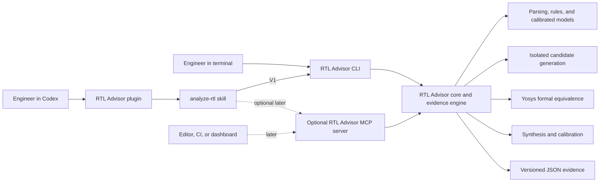

# RTL Advisor Codex Plugin V1 Implementation Plan

## 1. Objective

Create a repository-owned Codex plugin that lets engineers use RTL Advisor in
plain language while preserving the CLI as the single execution and evidence
engine.

The same analysis must remain available from a terminal. Codex may choose safe
commands, summarize results, and explain evidence, but it must not implement a
separate recommendation algorithm or override the CLI decision.

This interface track is independent from the frozen V2.3 model experiment. The
plugin may expose only capabilities that the installed CLI reports as ready. It
must not make failed or diagnostic-only models appear production-ready.

## 2. Product boundary

### 2.1 User entry points and component relationship



Solid lines are the V1 implementation. Dashed lines are later options, not V1
requirements.

- The **plugin** is the installable, shareable package engineers select in
  Codex. It can bundle skills and, later, MCP configuration.
- The **skill** is the Codex workflow that interprets the engineer's intent,
  selects supported operations, and explains results.
- The **CLI** is both the direct terminal interface and the V1 execution bridge
  used by the skill.
- The **core and evidence engine** owns all recommendation decisions,
  candidates, verification results, and provenance.
- An **MCP server** would be an optional structured connection to that same core
  or to approved internal services. It must not become another recommendation
  engine.

Engineers use the CLI directly in a terminal. In Codex, they install or select
the plugin and ask for the task in plain language; Codex invokes the bundled
skill. Engineers should not need to invoke MCP by name. If MCP is added, the
skill, editor, CI integration, or dashboard calls its tools behind the user
interface.

### 2.2 Responsibility and task delegation

| Task | V1 owner | Later MCP role |
| --- | --- | --- |
| Understand timing, area, or balanced intent | Codex skill | None |
| Discover supported inputs, tools, and model readiness | CLI capability command | Expose the same capability result as a tool |
| Parse RTL and compile context | RTL Advisor core | Transport the request only |
| Decide whether a change is recommended | RTL Advisor core | No independent decision logic |
| Explain a finding and its limitations | Codex skill | Supply structured evidence to the skill |
| Generate an isolated candidate | RTL Advisor core through CLI | Expose the same core operation as a tool |
| Prove logical equivalence | Formal backend controlled by the core | Submit or monitor an approved remote formal job |
| Run synthesis and compare PPA | Synthesis backend controlled by the core | Submit or monitor an approved remote synthesis job |
| Store hashes, commands, logs, and result artifacts | RTL Advisor CLI/core | Return stable artifact identifiers or approved links |
| Retrieve changing internal documents or design metadata | Out of scope unless available as approved local files | Query an approved internal service with user-scoped access |
| Present results in terminal, Codex, editor, CI, or dashboard | The selected user interface | Provide one structured tool contract across interfaces |

### 2.3 When MCP is justified

MCP becomes useful when RTL Advisor needs a live, structured, permission-aware
connection that a local subprocess and local files cannot provide cleanly. Add
it only when at least one concrete integration requires it.

| Need | MCP or connector value | Example for RTL Advisor |
| --- | --- | --- |
| Authenticated internal knowledge | Search and fetch current information using the engineer's approved access | Coding standards, design methodology, waiver policy, IP integration guides, or tool-flow documentation stored in SharePoint, Google Drive, Confluence, or an internal search service |
| Live design metadata | Query structured records without copying whole databases into the repository | Block ownership, hierarchy, approved build manifest, target library, clock targets, supported corners, or exception ownership |
| Remote EDA compute | Submit, monitor, cancel, and retrieve approved jobs through a stable tool interface | Internal Yosys, Genus, Conformal, formal, or OpenROAD farms that cannot run on the engineer's laptop |
| Historical evidence | Retrieve current results from a shared system of record | Prior synthesis runs, calibrated-family evidence, waiver history, regression status, or benchmark provenance |
| Cross-surface reuse | Give Codex, an editor, CI, and a dashboard the same typed operations | `review`, `generate_candidate`, `verify`, `submit_synthesis`, and `get_result` tools backed by the same core |
| Controlled actions | Apply per-user authorization, approvals, and audit records to material actions | Post a code-review note, open a tracking issue, request an owner review, or launch a licensed EDA job |
| Managed remote deployment | Reach RTL Advisor when the core runs as an internal service rather than on the local filesystem | A centrally maintained advisor service with versioned models and tool installations |

Internal documents are a good MCP use case only when they are private, changing,
and must be searched with current user authorization. If a design rule or CLI
contract is small, stable, and already versioned in this repository, it should
remain a skill reference or normal project documentation. MCP would add network,
authentication, availability, and security costs without improving that case.

MCP is **not** required for:

- Reading approved RTL and manifests already present in the workspace.
- Running the local RTL Advisor CLI, Yosys, Verilator, or OpenROAD.
- Using stable documentation committed with the repository.
- Producing versioned JSON evidence and local artifacts.
- Running CI jobs that can call the CLI directly.
- Packaging the workflow as a Codex plugin.

If MCP is introduced, use separate least-privilege connections where practical:
one read-only knowledge connection for internal documentation, one compute
connection for EDA jobs, and a separate write-capable connection for code-review
or issue actions. Default document and metadata tools to read-only. Require
explicit approval for writes, job submissions, or any transfer of RTL. Log tool
requests and artifact identifiers without exposing proprietary RTL or secrets.
Only approved internal servers should receive company data.

### 2.4 Example delegation flows

#### V1: local review and candidate verification

1. An engineer asks Codex: "Review `alu.sv` for timing opportunities and tell
   me whether synthesis probably handles them."
2. Codex triggers the plugin's `analyze-rtl` skill.
3. The skill calls `rtl-advisor agent capabilities --json` and confirms that
   the input, objective, tools, and model are supported.
4. The skill calls `rtl-advisor agent review alu.sv --objective timing --json`.
5. The CLI delegates parsing and the recommendation decision to the core. The
   core returns a stable decision, source location, evidence, limitation, run
   ID, and artifact paths.
6. The skill explains the unchanged decision in plain language and shows the
   exact reproducible command.
7. If the engineer explicitly requests a candidate, the skill calls the
   candidate command. The core writes it only to an isolated artifact workspace.
8. The skill calls the verification command. Yosys formal equivalence proves or
   rejects the candidate, and the core records the result and hashes.
9. The skill reports the diff and proof result. A failed or stale proof is
   reported as a failure; Codex does not reinterpret it as safe.

#### Later: internal knowledge and remote EDA flow

1. An engineer asks for the same review using the current internal coding guide,
   approved target constraints, and a Genus confirmation run.
2. The skill uses a read-only internal knowledge connector or MCP tool to fetch
   the relevant guide sections and record their source identifiers.
3. The skill queries approved design metadata for the block's target flow. It
   does not infer missing clocks, libraries, or constraints.
4. The skill calls the RTL Advisor review tool exposed by an internal MCP server,
   which delegates to the same core used by the CLI.
5. After explicit engineer approval, the compute tool submits the generated
   candidate and approved constraints to the internal Genus or formal service.
6. The MCP server returns a job ID; later calls retrieve status and versioned
   artifacts. The plugin explains the core result and links the internal
   evidence.
7. If documentation access, authorization, tool availability, or a proof fails,
   the workflow stops at that boundary and reports the exact missing evidence.

This later flow does not permit internal documentation, an MCP server, or Codex
to override formal correctness or the core release gates.

### 2.5 Decision for Plugin V1

Do not add MCP to Plugin V1. The local CLI already provides the required
analysis, candidate, formal, synthesis, and evidence operations. Introducing
MCP now would add another transport and security boundary before a real remote
integration exists.

Revisit the decision when the first approved internal integration is selected.
Before implementation, define its data classification, hosting boundary,
authentication, tool allowlist, approval rules, audit requirements, failure
behavior, and whether RTL content is allowed to cross that connection.

The architecture is therefore:

```text
V1:    Codex -> plugin -> analyze-rtl skill -> CLI -> RTL Advisor core
Later: Codex -> plugin -> analyze-rtl skill -> optional MCP -> same core
        Editor / CI / dashboard -------------> optional MCP -> same core
```

The CLI owns:

- RTL and filelist parsing.
- Environment and tool checks.
- Structural findings and deterministic rules.
- Model readiness and recommendation decisions.
- Candidate generation in an isolated artifact workspace.
- Lint, formal equivalence, synthesis, and provenance.
- Versioned JSON schemas, run identifiers, and exit status.

The Codex plugin owns:

- Translating an engineer's request into supported CLI operations.
- Asking for missing intent such as timing, area, or balanced optimization.
- Explaining findings in plain engineering language.
- Presenting source locations, tradeoffs, evidence strength, and limitations.
- Requesting explicit confirmation before optional candidate-generation work.
- Preserving and linking the exact commands and result artifacts it used.

Codex does not own correctness, eligibility, ranking, PPA truth, or source
mutation.

## 3. Repository structure

Use a repository marketplace and one versioned plugin:

```text
.agents/
└── plugins/
    └── marketplace.json

plugins/
└── rtl-advisor/
    ├── .codex-plugin/
    │   └── plugin.json
    └── skills/
        └── analyze-rtl/
            ├── SKILL.md
            ├── agents/
            │   └── openai.yaml
            ├── scripts/
            │   └── run_rtl_advisor.py
            └── references/
                ├── cli-contract.md
                └── result-interpretation.md
```

Plugin name: `rtl-advisor`.

Initial skill name: `analyze-rtl`.

Do not add an MCP server, app connector, hook, or background service in V1. The
local CLI subprocess is sufficient and keeps the first interface small and
auditable.

The repository marketplace entry must use the standard required installation,
authentication, and category policy fields. The plugin manifest must contain
only supported fields and must not declare companion components that do not
exist.

## 4. Engineer requests supported in V1

The skill should trigger for requests such as:

- "Analyze this generated RTL for timing risks."
- "Review this manifest and tell me whether any rewrite is worthwhile."
- "Explain why RTL Advisor recommends this candidate."
- "Would synthesis probably handle this automatically?"
- "Show the exact evidence behind this finding."
- "Generate the proposed candidate and run equivalence."
- "Compare the baseline and candidate synthesis results."
- "Summarize the analysis in a form I can put in a code review."

V1 inputs:

- A generated RTL Advisor case or manifest.
- An explicitly approved open RTL module supported by the current CLI.
- A previously created RTL Advisor run or evidence artifact.

Filelist, include-directory, macro-definition, and multi-top support enter the
plugin only after the shared CLI supports them through a stable JSON command.
The skill must report an unsupported input honestly instead of approximating a
result from raw source alone.

## 5. Shared CLI automation contract

Terminal users and the Codex skill must receive the same underlying result. Add
a small, stable automation surface rather than teaching the skill to scrape
human-formatted terminal output.

Target interface:

```text
rtl-advisor agent capabilities --json
rtl-advisor agent review <input> --objective timing|area|balanced --json
rtl-advisor agent candidate <run-id> --finding <finding-id> --json
rtl-advisor agent verify <run-id> --candidate <candidate-id> --json
```

The `agent` namespace is an automation API; it is not a second advisor. Each
command delegates to existing versioned analysis, candidate, and verification
modules.

### 5.1 Capabilities

`agent capabilities` must report:

- CLI and schema version.
- Available parsers and supported input forms.
- Tool availability for lint, formal, synthesis, and Codex explanation.
- Model versions and whether each is ready, diagnostic-only, or unavailable.
- Supported objectives and transformation families.
- Whether candidate generation and verification are available.

The plugin always calls this command before choosing a workflow. It must not
infer readiness from files or from a prior conversation.

### 5.2 Review result

`agent review` must return a versioned JSON object containing:

- Run ID, input hashes, compile context, objective, and status.
- Findings with stable IDs and source locations.
- One of: `recommended`, `synthesis_likely_handles`,
  `target_flow_confirmation`, `no_change`, `unsupported`, or `failed`.
- Expected delay, area, and cell-count direction when available.
- Evidence source: deterministic rule, calibrated model, synthesis calibration,
  or formal result.
- Model/readiness limitations written for display without translation.
- Artifact paths and the exact normalized command.

Codex may simplify the wording, but it must preserve the status, values, and
limitations.

### 5.3 Candidate and verification result

Candidate creation must use an artifact workspace and never modify the input.
The response must include original and candidate hashes, a unified diff, and
the validation stages that were requested.

A candidate may be described as behavior-preserving only after a current formal
equivalence result passes and its hashes match. Lint success alone is not
equivalence. Synthesis improvement is not correctness.

## 6. Skill operating procedure

The `analyze-rtl` skill uses this sequence:

1. Locate the repository and resolve the CLI without changing the environment.
2. Call `agent capabilities --json`.
3. Confirm the input is generated or explicitly approved and within the
   reported support boundary.
4. Default to read-only review and ask for an objective only when it materially
   changes the analysis.
5. Run the CLI command and retain its JSON result.
6. Check exit status, schema version, input hashes, and result status before
   explaining anything.
7. Present the source location, decision, reason, likely tradeoff, evidence,
   and limitation in plain language.
8. Generate a candidate only when the engineer explicitly asks for one.
9. Run formal verification before calling a candidate safe.
10. Report the exact command and artifact paths so the result can be reproduced
    directly in a terminal.

If the CLI reports a failed calibration gate, missing tool, unsupported input,
stale evidence, or failed proof, the skill stops that workflow and explains the
specific condition. It must not substitute its own RTL recommendation.

## 7. Command runner

Add one small deterministic script, `run_rtl_advisor.py`, to avoid environment-
specific command guessing. It resolves the executable in this order:

1. Explicit `RTL_ADVISOR_BIN` environment variable.
2. `rtl-advisor` available on `PATH`.
3. The repository's supported `uv run --no-editable rtl-advisor` command.

The runner accepts only the documented `agent` subcommands, passes arguments as
an array without shell interpolation, requires JSON output, preserves the CLI
exit code, and rejects malformed or unsupported schema versions. It does not
contain recommendation logic.

## 8. Safety and data handling

- Use generated or explicitly approved open RTL during plugin development and
  testing.
- Never send RTL to an external service unless the engineer and their company
  policy explicitly permit that deployment.
- Do not browse the web or contact external systems during RTL analysis.
- Do not modify input RTL, filelists, constraints, or build scripts.
- Keep candidate content under the versioned artifact directory.
- Require explicit user intent before candidate generation, synthesis, Docker,
  or other material compute.
- Do not run a held-out or blind benchmark through the conversational skill.
- Do not expose hidden labels, proprietary paths, credentials, or full internal
  logs in explanations.
- Preserve CLI errors and unavailable states rather than converting them into a
  recommendation.

For a company deployment, install the plugin and CLI inside the approved local
or internal environment. The repository plugin does not itself grant permission
to process proprietary RTL.

## 9. Presentation contract

Every normal finding should answer:

1. Where is it?
2. What did RTL Advisor observe?
3. Why might it matter?
4. Would synthesis likely handle it?
5. What action, if any, is recommended?
6. What evidence and limitations support the answer?

Use the following user-facing decisions:

- **Recommended** — evidence supports reviewing the proposed change.
- **Synthesis likely handles this** — source cleanup may help readability, but
  implementation benefit is not expected.
- **Target-flow confirmation needed** — results depend on synthesis settings or
  the target technology.
- **No change recommended** — no safe, useful candidate cleared the release
  criteria.
- **Analysis unavailable** — tools, model readiness, or input support prevented
  a trustworthy decision.

Do not present confidence as a vague percentage without the underlying evidence
or gate. Keep predicted PPA clearly separate from measured synthesis results.

## 10. Validation and acceptance

### 10.1 Package validation

- Scaffold the repository plugin with the official plugin-creator script.
- Generate the skill with the official skill-creator initializer.
- Validate `SKILL.md` with `quick_validate.py`.
- Validate the complete plugin with `validate_plugin.py`.
- Keep the plugin manifest, folder name, marketplace name, and source path
  consistent.
- Leave no placeholder or example-only files in the final package.

### 10.2 CLI/plugin parity

For each reference request, run the equivalent terminal and plugin workflows
against the same generated input. Require:

- Identical CLI run ID and semantic result hash.
- Identical finding IDs, decisions, metrics, and evidence references.
- Identical candidate and proof hashes when candidate generation is requested.
- No source hash changes.
- The plugin explanation introduces no unsupported claim.

### 10.3 Reference scenarios

Test at least these cases:

- A formally equivalent candidate with synthesis benefit that survives the
  stronger recipe.
- A rewrite that synthesis already absorbs.
- A synthesis-recipe-dependent tradeoff requiring target confirmation.
- A candidate that fails formal equivalence.
- A diagnostic-only model that must remain unavailable for live use.
- A missing Yosys or Verilator tool.
- An unsupported filelist or SystemVerilog construct.
- A request to edit source in place, which must be refused.

The plugin is ready for repository installation only when all package, parity,
safety, and regression tests pass.

## 11. Implementation sequence

### Phase 1 — Stable CLI boundary

- Define and test the versioned `agent` JSON schemas.
- Implement `capabilities`, `review`, `candidate`, and `verify` as adapters over
  existing modules.
- Add semantic hashes and source-integrity checks.
- Preserve current commands and outputs for existing users.

### Phase 2 — Repository plugin scaffold

- Create `plugins/rtl-advisor` and its required plugin manifest.
- Create `.agents/plugins/marketplace.json` with the repository entry.
- Initialize `skills/analyze-rtl` and generate its UI metadata.
- Add only the runner and two references listed in this plan.

### Phase 3 — Read-only conversational review

- Implement capability discovery and read-only review.
- Add plain-language result rendering and reproducibility details.
- Exercise generated examples for every user-facing decision state.

### Phase 4 — Candidate and formal workflow

- Add explicit candidate-generation handling.
- Require isolated output, source-integrity checks, lint, and formal proof.
- Add synthesis comparison only when requested and available.

### Phase 5 — Parity and installation validation

- Run package validators and the complete repository regression.
- Run terminal-versus-plugin parity scenarios.
- Install the repository marketplace locally and test in a fresh Codex thread.
- Document only the short installation and first-use commands in the project
  README after validation passes.

### Phase 6 — Later interfaces

After V1 is stable, reuse the same CLI JSON contract for:

- VS Code source annotations.
- CI and code-review comments.
- The internal dashboard's live-analysis workflow.

Do not create separate recommendation logic for any interface.

## 12. V1 completion criteria

Plugin V1 is complete when:

- A repository marketplace installs `rtl-advisor` successfully.
- Codex reliably triggers `analyze-rtl` for the registered request patterns.
- Terminal and conversational workflows produce identical semantic results.
- Read-only review never changes source files.
- Candidate generation requires explicit intent and uses an isolated workspace.
- Every candidate called safe has a current hash-matched equivalence proof.
- Diagnostic-only models remain visibly unavailable.
- All package validators, reference scenarios, and repository tests pass.
- The project README explains the human workflow without requiring model or EDA
  vocabulary.

The next implementation action is Phase 1: add and test the stable CLI
automation boundary before scaffolding the plugin that depends on it.
