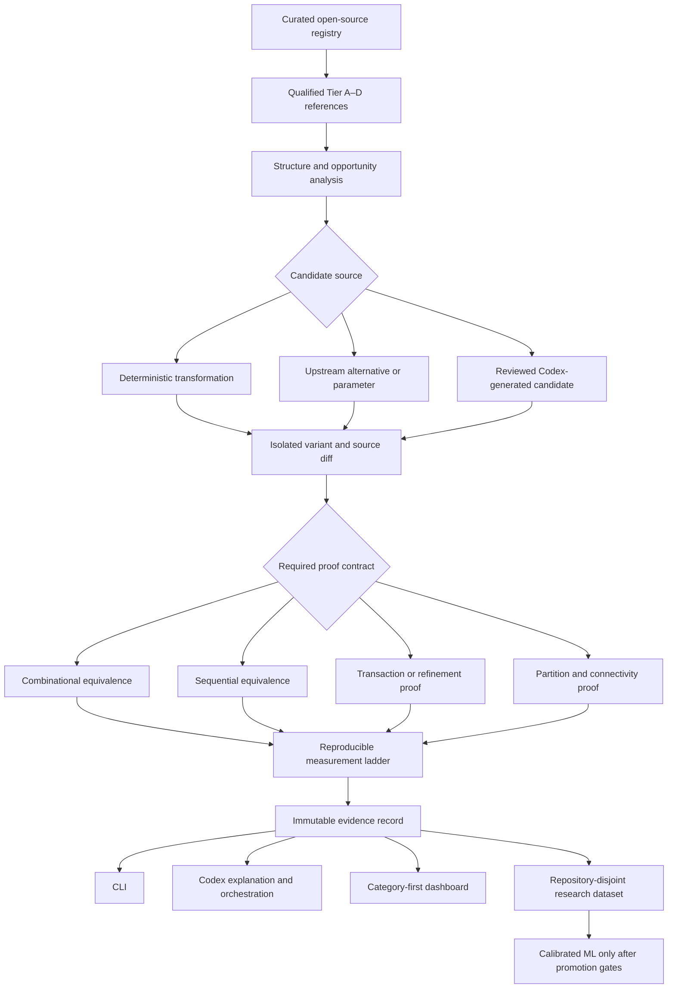

# RTL Advisor Project Roadmap V1

> **Authority:** This is the controlling long-range implementation roadmap.
> [MVP V1](MVP%20V1.md) remains the frozen record for the completed developer
> preview. [Corpus Strategy V1](corpus%20strategy%20v1.md) controls corpus
> admission, counting, proof levels, and data separation. Older model,
> frontend, and plugin plans are subordinate wherever they conflict with this
> roadmap. [Project Checklist V1](project%20checklist%20v1.md) is the live
> completion record and must be updated with each implementation increment.

## 1. Project goal

Build an evidence-backed RTL engineering platform that studies real designs at
module, IP, subsystem, and SoC scale; proposes isolated implementation
alternatives; proves the appropriate behavioral contract; measures results in
reproducible synthesis and implementation flows; and tells engineers when a
change helps, hurts, depends on the flow, or is already handled by synthesis.

The product is not a code-style linter, a collection of RTL files, or a model
that guesses PPA from syntax. Its durable asset is the combination of:

```text
qualified hierarchical RTL references
                +
meaningful and traceable implementation variants
                +
proof evidence at the correct semantic level
                +
same-flow synthesis and physical measurements
                +
source-linked engineer workflow
```

## 2. Where the completed MVP fits

MVP V1 proved one vertical mechanism:

- Deterministic detection of one combinational adder family.
- Isolated candidate rewriting and immutable diffs.
- Direct Yosys RTL-to-RTL combinational equivalence.
- Two pinned Yosys/ABC comparisons.
- CLI, Codex plugin, evidence schema, and read-only run viewer.
- Honest neutral evidence: synthesis handled the generated example.

It did not prove usefulness across open RTL. The pre-registered pilot found
zero qualifying modules, which exposes the next platform requirement: broader
hierarchical references, richer compile contexts, sequential proof, and
category-based evidence organization.

The MVP implementation remains supported while the project expands. Its
schemas are migrated through explicit versions rather than silently redefined.

## 3. System architecture



The CLI owns execution. Codex invokes the same commands and explains their
records. The dashboard remains read-only. MCP becomes useful only when approved
internal systems must provide manifests, documentation, run metadata, or
target-flow results; it is not required for the local open-source program.

## 4. Product workstreams

### 4.1 Corpus and provenance

- Implement the Tier A–D source registry and qualification state machine.
- Resolve complete dependency graphs without treating dependencies as new
  benchmark examples.
- Record exact revisions, licenses, compile contexts, configurations, tests,
  and hashes.
- Preserve references and all evidence outside distributable packages.
- Publish corpus coverage by tier, category, upstream lineage, and proof level.

### 4.2 Analysis and candidate generation

- Move from one expression rule to structural analysis over syntax and
  elaborated design graphs.
- Separate opportunity detection from variant generation and final decisions.
- Support deterministic transformations first; add reviewed generative
  candidates only through the same isolated artifact boundary.
- Group transformations by engineering category and semantic contract, not by
  superficial syntax.
- Retain every attempted candidate and rejection reason.

### 4.3 Formal and correctness evidence

- Preserve the current combinational Yosys proof path.
- Add EQY-backed or reviewed-miter same-latency sequential equivalence.
- Add latency-aware ready/valid and request/response transaction proof.
- Add subsystem partitioning and assume-guarantee contracts.
- Add generated-connectivity comparison and integration properties for SoCs.
- Keep commercial LEC as a later target-flow confirmation, never a requirement
  for the open MVP.

### 4.4 Synthesis and physical evidence

- Keep standard and stronger Yosys/ABC recipes as the reproducible base layer.
- Add parameterized clocks, multiple tops, memories, and black-box handling.
- Reintroduce OpenROAD as a physical cross-check after logical evidence is
  stable.
- Define adapters for Genus, Design Compiler, Conformal, and target flows on
  approved machines without making them open-source release dependencies.
- Report conclusions per flow and preserve disagreement.

### 4.5 Engineer interfaces

- CLI: complete control, automation, scripting, and CI integration.
- Codex skill/plugin: natural-language orchestration and explanation of the
  exact CLI evidence.
- Dashboard: straightforward exploration of categories, references, variants,
  proofs, and synthesis tables.
- MCP: optional bridge to internal documentation, design registries, artifact
  stores, job schedulers, and commercial-flow results.

### 4.6 Research and ML

- Treat proof-qualified, measured reference/variant pairs as training rows.
- Split evaluation by repository, lineage, topology, hierarchy, and containing
  SoC.
- Benchmark deterministic rules, ML, and Codex as separate decision producers.
- Keep ML diagnostic-only until independent release gates pass.
- Train models to estimate opportunity and flow sensitivity, not to certify
  correctness.

## 5. Sequential implementation waves

Each wave produces usable infrastructure and an evidence lock. A positive PPA
result is never required to complete a wave.

### Wave 0 — Strategic reset and contract freeze

Deliverables:

- This project roadmap.
- Corpus Strategy V1.
- Explicit relationship to completed MVP V1 and subordinate research plans.
- Frozen terminology for source, reference, variant, proof, and measurement.
- Initial source allowlist without downloading or inspecting variant PPA.

Gate:

- Plans agree on Tier A–D counting, proof levels, and evidence boundaries.
- No generated example or individual file is misreported as corpus coverage.

### Wave 1 — Corpus Registry V1

Implement:

- `CorpusReferenceManifest v1` for all tiers.
- `CorpusVariantManifest v1` with parent lineage and proof-contract identity.
- Registry states: discovered, license reviewed, pinned, build reproduced,
  behavior baselined, qualified, and variant eligible.
- CLI operations to add, validate, inspect, and summarize registry records.
- JSON schemas and deterministic semantic hashes.
- Coverage reporting by tier, category, source, license, and status.
- Tests that reject file-count inflation, duplicate forks, missing dependencies,
  mutable revisions, incomplete licenses, and cross-split lineage leakage.

Compatibility:

- Adapt the existing `PilotManifest v1` into or alongside the new reference
  manifest without changing stored MVP runs.
- Keep third-party RTL and large evidence outside the wheel and plugin.

Gate:

- Registry fixtures reconstruct identically in a clean temporary workspace.
- Existing 304-test MVP regression remains green.

### Wave 2 — First Tier A tranche and sequential proof foundation

**Status: complete on July 19, 2026.** The frozen 12-reference tranche ended
with eight qualified references and four explicit blockers. The gate includes
three upstream lineages, six categories, seven qualified stateful modules, two
documented equivalent pairs, P2 and P3 proof foundations, negative controls,
30 passing upstream tests, and baseline-only M0/M1 characterization for all 12.

Pre-register 12 reference candidates from at least three upstream projects and
four categories. Start with:

- OpenTitan `prim_arbiter_tree`, `prim_arbiter_ppc`, and `prim_fifo_sync`.
- PULP `cc_spill_register`, `cc_stream_register`, `cc_stream_fifo`,
  `cc_rr_arb_tree`, and selected mux/demux structures.
- PULP AXI `axi_cut` and `axi_multicut` only if their complete dependency context
  fits the Tier A admission rule; otherwise retain them for Tier B.
- Frozen MIT `verilog-axis` pipeline modules only after recording their
  deprecated-upstream status.

Implement:

- Clean source acquisition with exact revision and license hashes.
- Reproducible Bender/filelist resolution and standalone wrappers where
  permitted.
- Clock, reset, parameter, and assumption support in reference manifests.
- P2 same-latency sequential equivalence using EQY or an independently reviewed
  Yosys formal miter.
- Negative sequential mutations proving the checker detects broken state,
  reset, grant, and transaction behavior.
- First latency-aware ready/valid transaction contract prototype.

Gate:

- Every pre-registered candidate ends as qualified, rejected, or explicitly
  blocked; none is silently replaced after results are visible.
- At least eight references qualify, including four stateful designs and one
  independently documented equivalent implementation pair.
- Proof records invalidate on any source, parameter, assumption, tool, or
  compile-context change.

### Wave 3 — Tier A completion and transformation portfolio

**Status: current.** Freeze the expansion and transformation families before
candidate synthesis outcomes are visible.

Expand to 50–100 qualified Tier A modules across at least eight categories and
five independent upstream lineages.

Implement and benchmark a reviewed portfolio such as:

- Arbiter tree and priority organization.
- FIFO implementation and fall-through/skid-buffer placement.
- Ready/valid register cuts and bypass paths.
- Decoder/address-map factoring.
- Mux/demux and routing topology.
- Width conversion and datapath segmentation.
- Arithmetic resource sharing and operator placement.
- Counter, queue, and state-machine encoding where proofable.

For each supported family:

- Include positive, neutral, regressed, and deliberately incorrect examples.
- Publish detection coverage and every exclusion.
- Require the proof contract before measurement.
- Run M0/M1 on all proof-passing candidates and a pre-registered M2 OpenROAD
  sample.

Dashboard milestone:

- Replace the research-first landing view with category-first navigation.
- Category → reference design → reference RTL/variant diff → formal result →
  synthesis comparison table.
- Keep model-confidence and research diagnostics in a secondary view.

Gate:

- Tier A meets the Corpus Strategy V1 completion gates.
- No recommendation is justified only by a model score or Codex opinion.

### Wave 4 — Tier B complete IP blocks

Qualify 15–30 complete IP blocks, beginning with pre-registered subsets of PULP
AXI, OpenTitan TL-UL, complete FIFO/interconnect IPs, and additional independent
projects.

Implement:

- Multi-file dependency and package graphs.
- Multiple clocks/resets, memories, parameter matrices, and legal black boxes.
- IP-level test and protocol-reference adapters.
- P2/P3 block proofs and proof partitioning.
- Hierarchical synthesis reporting and critical-cone source mapping.

Gate:

- At least three independent protocol families and five upstream lineages.
- Reference/variant results reproduce from clean containers.
- Unsupported proof scopes are reported honestly rather than replaced with
  simulation-only equivalence claims.

### Wave 5 — Tier C processor and accelerator subsystems

Qualify 5–10 subsystems from independent lineages. Candidate sources include
Ibex, CV32E40P, Hazard3, CVFPU/FPnew, PicoRV32 units, and an open accelerator.

Implement:

- Stage and transaction boundary identification.
- Latency/refinement maps for pipeline-depth changes.
- Architectural scoreboards for multi-cycle units.
- Assume-guarantee partition contracts and compositional proof records.
- Workload-aware synthesis configuration without using workloads as formal
  correctness substitutes.

Gate:

- At least two processor and two accelerator lineages.
- At least one same-latency stage rewrite and one latency-changing candidate
  complete the required proof and measurement ladder.

### Wave 6 — Tier D complete SoCs

Pre-register and qualify 2–4 complete SoCs from distinct lineages. OpenTitan is
the first discovery candidate; the remaining sources are chosen and frozen
before any variant PPA is inspected.

Implement:

- Generator input and generated-output provenance.
- Connectivity graph comparison for buses, interrupts, clocks, resets, memory
  maps, and instantiated parameters.
- Build orchestration and partitioned proof reuse from contained Tier B/C
  entries.
- SoC-level compilation, smoke workloads, hierarchical synthesis, and selected
  OpenROAD or target-flow partitions.

Gate:

- Reproducible clean build and integration evidence for every SoC.
- Claims are scoped to checked properties and partitions; no unsupported claim
  of monolithic whole-SoC formal equivalence.

### Wave 7 — Model benchmark and promotion

Only after sufficient proof-qualified diversity exists:

- Freeze repository-, lineage-, topology-, and hierarchy-disjoint splits.
- Compare deterministic rules, calibrated ML, and Codex on identical
  opportunities.
- Measure recommendation correctness, harmful recommendations, missed useful
  changes, flow disagreement, proof yield, and calibration.
- Keep held-out Tier D systems and independent categories sealed until policy
  and thresholds are frozen.
- Promote a model only if it adds safe coverage over deterministic rules and
  passes all release gates.

The model may rank or prioritize candidates. Formal and measured evidence remain
the authorities for correctness and observed PPA.

### Wave 8 — Internal productization

- Harden CLI and plugin installation, version negotiation, migrations, and
  artifact retention.
- Add authentication and authorization only when connecting to internal
  systems.
- Add optional MCP services for design metadata, internal documentation,
  artifact stores, and approved EDA jobs.
- Add commercial synthesis/LEC adapters on company-controlled machines.
- Define privacy, source-retention, audit, and approval policies before any
  proprietary RTL enters the system.
- Run a limited engineer pilot with task completion and trust/usability metrics.

## 6. Dashboard information architecture

The dashboard is an evidence browser, not the source of truth and not an EDA
job launcher.

```text
Overview
├── Corpus coverage: Tier A / B / C / D
├── Engineering categories
│   └── Category
│       └── Qualified reference
│           ├── Frozen source and configuration
│           ├── Variants and diffs
│           ├── Formal/verification evidence
│           └── Per-flow synthesis comparison
├── Runs and failures
├── Tool and evidence locks
└── Research evidence
```

The primary design page answers, in order:

1. What real design is this and where did it come from?
2. What changed?
3. Was the correct behavioral contract proven?
4. What did each synthesis or physical flow measure?
5. Should an engineer act, keep the original, or confirm in a target flow?

Terms such as confidence, coverage, harmful rate, or model diagnostics remain
in the research view unless translated into a concrete engineer decision.

## 7. Version and artifact boundaries

Introduce new version domains rather than overloading MVP versions:

- Corpus registry schema: `rtl-advisor-corpus-v1`.
- Reference manifest: `rtl-advisor-reference-v1`.
- Variant manifest: `rtl-advisor-variant-v1`.
- Proof contract: `rtl-advisor-proof-v1` with explicit proof level.
- Measurement record: extend through a versioned migration from
  `rtl-advisor-run-v1`.
- Package and plugin versions change only when implementation begins, not when
  this planning document is added.

All artifacts remain content-addressed and append-only. Derived reports can be
regenerated; source, proof, and measurement records cannot be overwritten.

## 8. Current next move

Wave 1, Corpus Registry V1, is complete. It provides strict reference, variant,
and proof schemas; stage-aware validation; semantic hashes; append-only storage;
four CLI operations; lineage/counting/split protections; coverage summaries;
and a metadata-only OpenTitan arbiter fixture. The full repository regression
passes 320 tests.

Proceed to Wave 2 without inspecting variant PPA:

1. Pre-register the exact 12-candidate Tier A tranche.
2. Freeze upstream revisions and license dispositions.
3. Obtain approval and download only those pinned archives.
4. Resolve and hash complete compile contexts, then reproduce upstream build,
   lint, tests, and reference synthesis.
5. Add P2 sequential proof and negative controls before measuring stateful
   alternatives.

## 9. User intervention

Pause only for actions that require new authority:

- Approving network downloads of pinned upstream source archives.
- Confirming corporate acceptability of licenses or redistribution.
- Starting Docker or commercial tools unavailable in the local environment.
- Providing access to internal documentation, artifact stores, or EDA systems.
- Authenticating a release, push, or pull request when credentials are needed.

No proprietary RTL is required through Tier A and the initial Tier B work.
